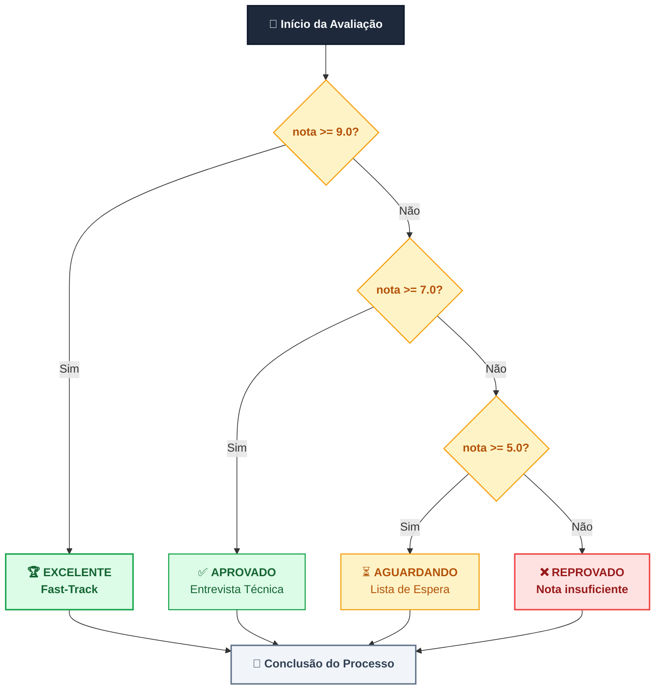
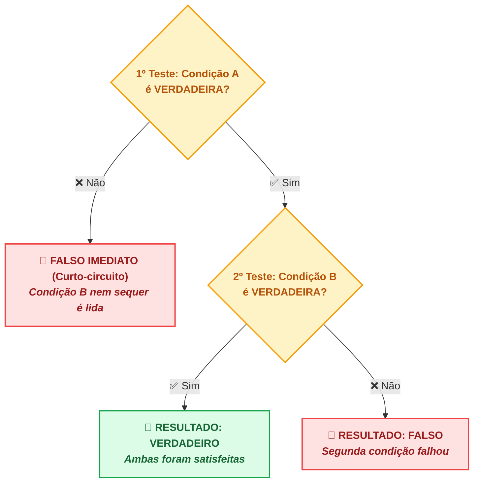
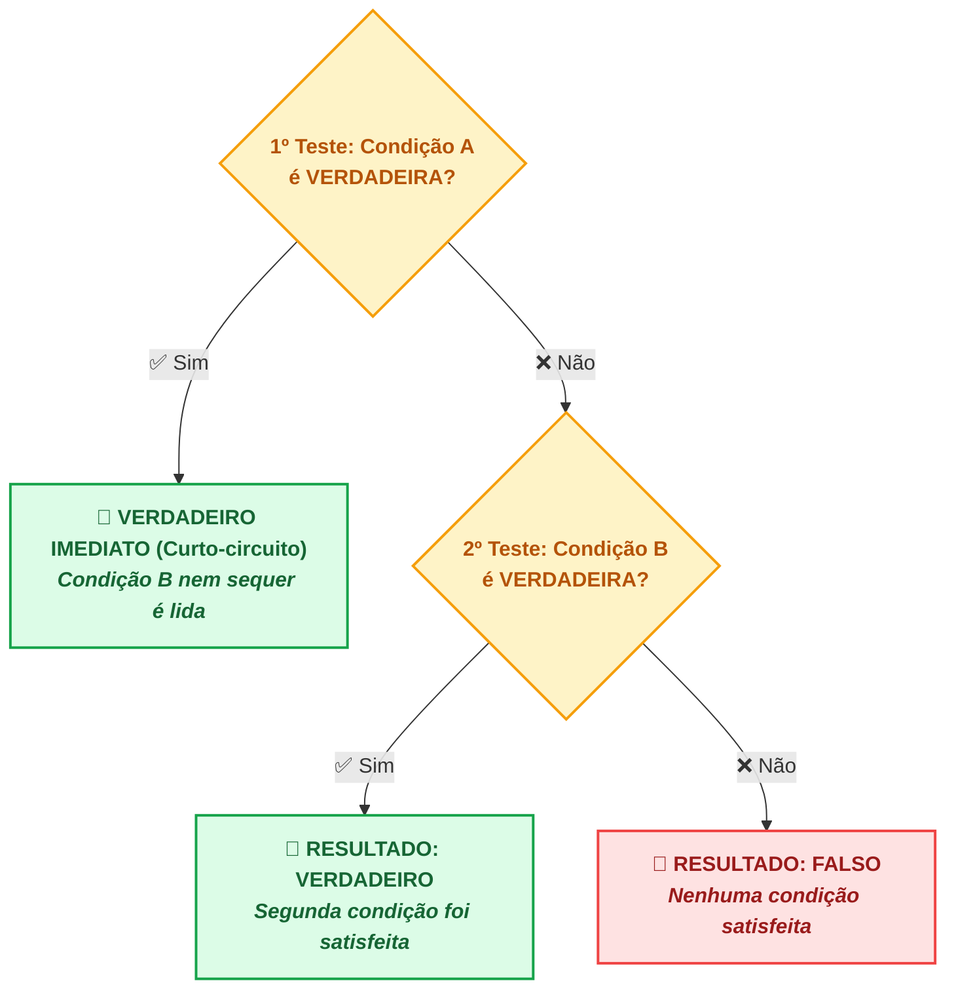
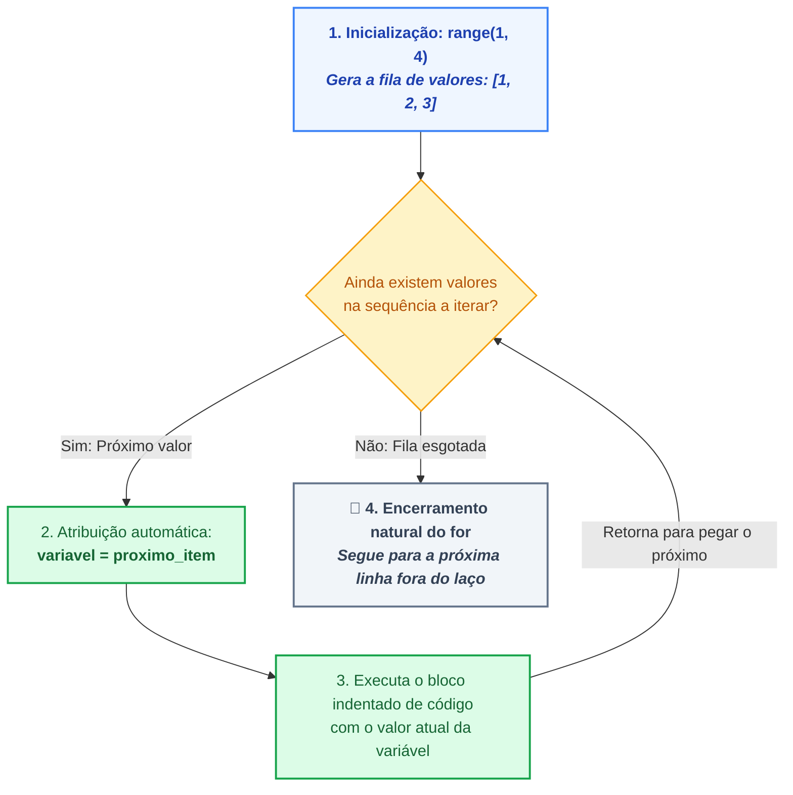
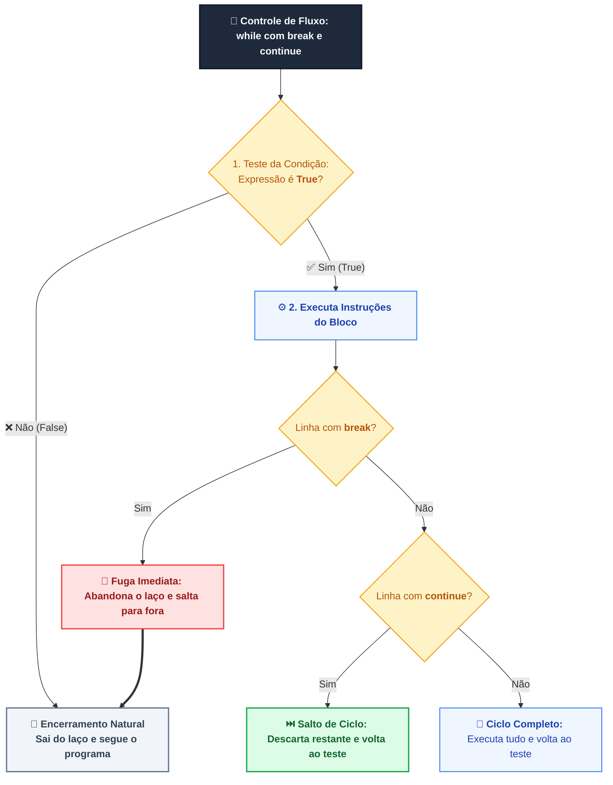
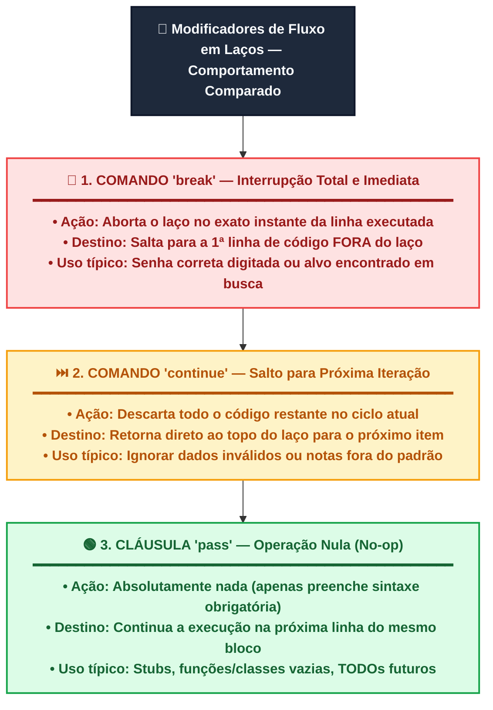
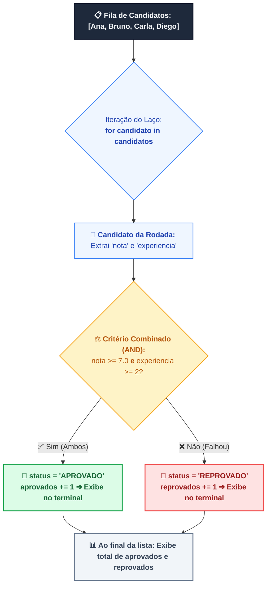
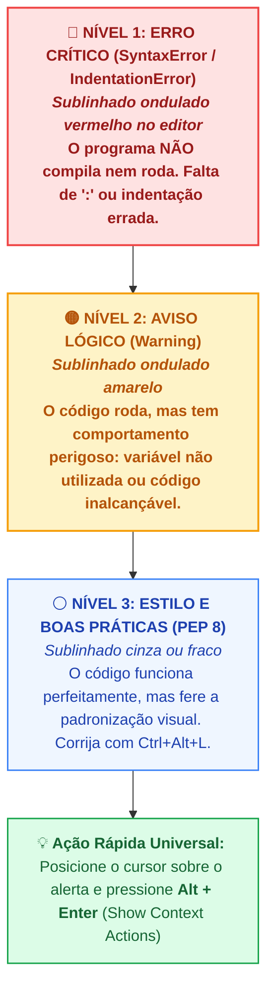
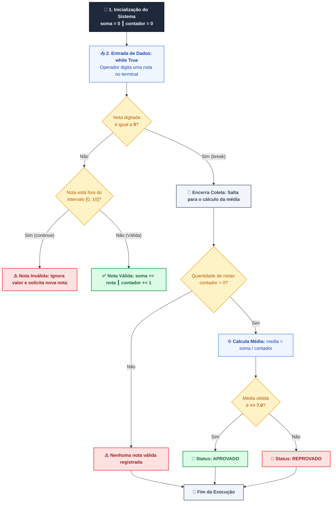

# Guia de Estudos e Prática Autônoma — Aula 2: Controle de Fluxo: Decisões e Laços de Repetição

## 📋 Ficha Técnica da Aula

| Item                      | Especificação                                                                                                                                                                                                                                                                                                     |
| :------------------------ | :---------------------------------------------------------------------------------------------------------------------------------------------------------------------------------------------------------------------------------------------------------------------------------------------------------------- |
| **Curso**                 | Programação em Python (Aperfeiçoamento)                                                                                                                                                                                                                                                                           |
| **Unidade Curricular**    | UC3: Desenvolver Aplicações Back-end para Web com Python                                                                                                                                                                                                                                                          |
| **Carga Horária**         | 4 horas presenciais / autônomas                                                                                                                                                                                                                                                                                   |
| **IDE Obrigatória**       | JetBrains PyCharm (Community ou Professional)                                                                                                                                                                                                                                                                     |
| **Ambiente Operacional**  | Windows 10/11 com Terminal PowerShell                                                                                                                                                                                                                                                                             |
| **Indicadores Avaliados** | **Indicador 2:** Utilizar estruturas de decisão (`if`, `elif`, `else`) e operadores relacionais/lógicos para implementar regras de negócio.<br/>**Indicador 3:** Implementar laços de repetição (`for`, `while`) com controle de fluxo (`break`, `continue`) para processar coleções de dados de forma eficiente. |

---

> [!NOTE]
> **Visão Geral da Aula**
> Nesta aula você dominará as duas grandes ferramentas de controle de fluxo em Python: **estruturas de decisão** e **laços de repetição**. Aprenderá a usar `if`, `elif` e `else` para tomar decisões com base em condições, combinando operadores relacionais (`==`, `!=`, `>`, `<`, `>=`, `<=`) e lógicos (`and`, `or`, `not`, `in`). Em seguida, explorará a repetição determinada com `for` e `range()`, e a repetição indeterminada com `while`, `break` e `continue`. O laboratório prático culmina na construção de um sistema real de validação de notas técnicas para o processo seletivo da JWC Tecnologia.

---

## 🏢 1. Contexto Corporativo — O Desafio na JWC Tecnologia

É segunda-feira, 9h da manhã. Você acabou de fazer seu café e abriu o PyCharm quando uma mensagem do seu Tech Lead, Rafael Menezes, aparece no Slack corporativo:

> *"Bom dia, dev! Precisamos urgente de um validador de notas para o nosso processo seletivo. O RH tá recebendo planilhas com notas fora do intervalo válido (abaixo de 0 ou acima de 10) e isso tá quebrando os relatórios de aprovação. A regra de negócio é simples: lemos as notas uma a uma em loop, descartamos qualquer valor inválido usando `continue`, e ao final calculamos a média e o status de aprovação (≥ 7.0 = APROVADO). Preciso disso rodando hoje. Pode pegar essa task? — Rafael"*

O desafio está claro. Você precisará de tudo que esta aula ensina: condicionais para validar os valores, laços para processar múltiplas notas, e `break`/`continue` para controlar o fluxo. Mãos ao teclado!

> [!NOTE]
> **Momento Carreira: Hard Skills vs. Soft Skills no Recrutamento Tech**
> Na seleção de desenvolvedores da JWC Tecnologia, dois conjuntos de competências são avaliados:
> - **Hard Skills (Habilidades Técnicas):** Seu domínio prático da linguagem Python, controle de fluxo (`if`/`while`/`for`), entendimento de tipos e capacidade de escrever código limpo.
> - **Soft Skills (Habilidades Comportamentais):** Comunicação assertiva com o time, proatividade na busca de soluções, capacidade de trabalhar sob pressão, adaptabilidade a mudanças de requisitos e empatia no trabalho em equipe.
> *Lembre-se: As Hard Skills abrem as portas para a entrevista técnica, mas as Soft Skills garantem sua permanência e crescimento sustentável na carreira de engenharia de software.*

<div style="page-break-before: always;"></div>

## 🧪 2. Controle de Fluxo — Decisões e Repetições

### 2.1 Estruturas de Decisão: `if`, `elif`, `else`

O bloco `if` permite que seu programa **tome caminhos diferentes** dependendo de uma condição booleana. Em Python, a indentação (recuo de 4 espaços) é obrigatória e define o bloco de código associado a cada cláusula.

```python
# Sintaxe básica
if condição:
    # bloco executado se a condição for VERDADEIRA
elif outra_condição:
    # bloco executado se a condição anterior for FALSA e esta for VERDADEIRA
else:
    # bloco executado se NENHUMA condição anterior for VERDADEIRA
```

> [!IMPORTANT]
> **Indentação é sintaxe em Python!** Diferentemente de linguagens com `{}`, Python usa espaços/tabs para delimitar blocos. Use **sempre 4 espaços** (o PyCharm faz isso automaticamente ao pressionar `Tab`). Misturar tabs e espaços gera `IndentationError` ou `TabError`.

**Exemplo real — Classificação de nota técnica:**

```python
# Classificação de nota do teste técnico de candidato
nota = float(input("Nota do candidato (0 a 10): "))

if nota >= 9.0:
    print("Status: EXCELENTE — Candidato indicado para Fast-Track")
elif nota >= 7.0:
    print("Status: APROVADO — Candidato segue para entrevista técnica")
elif nota >= 5.0:
    print("Status: AGUARDANDO — Candidato em lista de espera")
else:
    print("Status: REPROVADO — Candidato não atingiu pontuação mínima")
```

---

🧠 **Lógica Visual:**



---

### 2.2 Operadores Relacionais e Lógicos

Os operadores são a "linguagem das condições" em Python. Eles retornam sempre `True` ou `False`.

#### Operadores Relacionais (comparação)

| Operador | Significado | Exemplo | Resultado |
| :---: | :--- | :--- | :---: |
| `==` | Igual a | `7 == 7` | `True` |
| `!=` | Diferente de | `7 != 8` | `True` |
| `>` | Maior que | `9 > 7` | `True` |
| `<` | Menor que | `3 < 7` | `True` |
| `>=` | Maior ou igual a | `7 >= 7` | `True` |
| `<=` | Menor ou igual a | `6 <= 7` | `True` |

> [!WARNING]
> **Armadilha clássica:** `=` é **atribuição** (salva um valor em variável). `==` é **comparação** (verifica igualdade). Usar `=` dentro de um `if` gera `SyntaxError`. Exemplo errado: `if nota = 7:` ❌ — Correto: `if nota == 7:` ✅

#### Operadores Lógicos (combinação)

| Operador | Comportamento | Exemplo | Resultado |
| :---: | :--- | :--- | :---: |
| `and` | Verdadeiro **somente se AMBOS** forem verdadeiros | `nota >= 7 and presenca >= 75` | Depende dos valores |
| `or` | Verdadeiro se **PELO MENOS UM** for verdadeiro | `reprovado or ausente` | Depende dos valores |
| `not` | **Inverte** o valor lógico | `not aprovado` | Inverte `True`/`False` |
| `in` | Verifica **pertencimento** em sequência | `"Python" in skills` | `True` se contiver |

```python
# Exemplo combinado — regra de aprovação com presença
nota = 8.5
presenca = 80  # percentual

# Usando AND: ambas as condições devem ser verdadeiras
if nota >= 7.0 and presenca >= 75:
    print("✅ APROVADO POR CRITÉRIO COMPLETO")

# Usando OR: basta uma das condições
if nota < 5.0 or presenca < 50:
    print("❌ REPROVADO AUTOMATICAMENTE")

# Usando NOT: inverte a condição
em_lista_negra = False
if not em_lista_negra:
    print("Candidato elegível para participar do processo")

# Usando IN: verifica se elemento pertence a uma coleção
linguagens_exigidas = ["Python", "SQL", "Git"]
if "Python" in linguagens_exigidas:
    print("Requisito de Python: atendido ✅")
```

> [!TIP]
> **Curto-circuito (Short-circuit evaluation):** Python avalia `and` e `or` de forma eficiente. Com `and`, se a primeira condição for `False`, a segunda **não é avaliada** (já sabemos o resultado). Com `or`, se a primeira for `True`, a segunda **não é avaliada**. Isso é útil para evitar erros em condições encadeadas.

---

🧠 **Lógica Visual — Fluxo de Decisão dos Operadores Lógicos (`and` vs. `or`):**

#### 1. Operador `and` (Conjunção — Curto-Circuito no Falso):



#### 2. Operador `or` (Disjunção — Curto-Circuito no Verdadeiro):



---

### 2.3 Repetição Determinada: `for` e `range()`

O laço `for` é usado quando você sabe **quantas vezes** (ou **sobre quais itens**) deseja iterar. A função `range()` gera sequências numéricas de forma eficiente.

**Sintaxe do `range()`:**

```python
range(stop)           # 0, 1, 2, ..., stop-1
range(start, stop)    # start, start+1, ..., stop-1
range(start, stop, step)  # start, start+step, ..., < stop
```

```python
# Iterando de 1 a 5
for i in range(1, 6):
    print(f"Candidato número {i} processado.")

# Saída:
# Candidato número 1 processado.
# Candidato número 2 processado.
# Candidato número 3 processado.
# Candidato número 4 processado.
# Candidato número 5 processado.

# Iterando com passo (step) — processar apenas candidatos de IDs pares
for id_candidato in range(2, 21, 2):
    print(f"Processando candidato ID: {id_candidato}")

# Iterando sobre uma lista
cargos_disponiveis = ["Dev Back-end", "Dev Front-end", "DBA", "DevOps"]
for cargo in cargos_disponiveis:
    print(f"  • Vaga disponível: {cargo}")
```

> [!NOTE]
> O `for` em Python é um **iterador** — ele percorre qualquer objeto iterável: listas, tuplas, strings, dicionários, arquivos, etc. O `range()` é apenas a forma mais comum de gerar uma sequência numérica para iterar.

---

🧠 **Lógica Visual — Ciclo de Execução Interno do Laço `for` com `range()`:**



---

### 2.4 Repetição Indeterminada: `while`, `break` e `continue`

O laço `while` repete um bloco **enquanto uma condição for verdadeira**. Use-o quando você **não sabe antecipadamente** quantas iterações serão necessárias — por exemplo, ao ler entrada do usuário até que ele queira parar.

```python
# Sintaxe básica do while
while condição:
    # bloco repetido enquanto condição for True
```

**`break` — Interrompe o laço imediatamente:**

```python
tentativas = 0
senha_correta = "jwc2024"

while True:  # laço potencialmente infinito — controlado por break
    senha = input("Digite a senha de acesso: ")
    tentativas += 1

    if senha == senha_correta:
        print(f"✅ Acesso liberado após {tentativas} tentativa(s).")
        break  # sai do while imediatamente

    if tentativas >= 3:
        print("❌ Número máximo de tentativas atingido. Conta bloqueada.")
        break
    
    print(f"Senha incorreta. Tentativas restantes: {3 - tentativas}")
```

**`continue` — Pula para a próxima iteração:**

```python
# Processar notas, ignorando valores inválidos
notas = [8.5, -1, 7.0, 11, 9.0, 6.5]

for nota in notas:
    if nota < 0 or nota > 10:
        print(f"  ⚠️  Nota {nota} inválida — ignorando.")
        continue  # pula o resto do bloco e vai para a próxima nota
    
    print(f"  ✅ Nota válida processada: {nota}")
```

---

🧠 **Lógica Visual — Fluxo do `while` com `break` e `continue`:**



> [!CAUTION]
> **Laço Infinito:** Se a condição do `while` nunca se tornar `False` e não houver um `break` no caminho correto, seu programa travará. No PyCharm, você pode interromper um programa travado clicando no botão **🔴 Stop** no painel de execução, ou pressionando `Ctrl + F2`. No terminal, use `Ctrl + C`.

---

### 2.5 A Cláusula `pass`: O Marcador de Posição (*Placeholder*)

Em Python, a estrutura do código depende obrigatoriamente da indentação. Isso significa que **não é permitido deixar um bloco condicional, de repetição ou de função completamente vazio**, pois o interpretador acusará `IndentationError: expected an indented block`.

Para resolver isso, a linguagem disponibiliza a palavra-chave **`pass`**. Ela é uma operação nula (*no-op*): quando executada, absolutamente nada acontece, permitindo que a sintaxe seja válida enquanto a lógica ainda está sendo planejada.

```python
# 1. Em um if/else quando uma das condições não requer ação imediata:
cargo = "Dev Back-end Júnior"

if cargo == "Dev Back-end Júnior":
    pass  # TODO: implementar cálculo de bonificação específico futuramente
else:
    print("Cargo sem bonificação extraordinária.")

# 2. Em um laço for/while para criar esqueletos de rotinas (stubs):
for candidato in ["Alice", "Bob", "Carlos"]:
    pass  # O loop é executado sem erro, aguardando a lógica definitiva

# 3. Em funções ou classes vazias em fase de rascunho:
def calcular_encargos_trabalhistas():
    pass  # Evita que o programa quebre enquanto a função não está pronta
```

> [!TIP]
> **Resumo dos 3 Modificadores de Fluxo:**
> - **`break`:** Interrompe e encerra o laço imediatamente.
> - **`continue`:** Interrompe apenas a iteração atual e salta para a próxima.
> - **`pass`:** Não interrompe nada; serve apenas para preencher blocos vazios com sintaxe válida.

---

🧠 **Lógica Visual — Comparativo de Desvio de Fluxo (`break` vs. `continue` vs. `pass`):**



---

### 2.6 Combinando Tudo: `for`/`while` com Condicionais

Na prática, laços e condicionais sempre trabalham juntos. Veja um exemplo integrado:

```python
# Processamento de candidatos com múltiplos critérios
candidatos = [
    {"nome": "Ana Lima",    "nota": 8.5, "experiencia": 3},
    {"nome": "Bruno Costa", "nota": 6.0, "experiencia": 1},
    {"nome": "Carla Dias",  "nota": 9.2, "experiencia": 5},
    {"nome": "Diego Melo",  "nota": 4.5, "experiencia": 2},
]

aprovados = 0
reprovados = 0

print("=" * 50)
print("   RESULTADO DO PROCESSO SELETIVO JWC")
print("=" * 50)

for candidato in candidatos:
    nome = candidato["nome"]
    nota = candidato["nota"]
    exp  = candidato["experiencia"]

    # Critério: nota >= 7.0 E experiência >= 2 anos
    if nota >= 7.0 and exp >= 2:
        status = "✅ APROVADO"
        aprovados += 1
    else:
        status = "❌ REPROVADO"
        reprovados += 1

    print(f"  {nome:<15} | Nota: {nota} | Exp: {exp}a | {status}")

print("-" * 50)
print(f"  Aprovados: {aprovados} | Reprovados: {reprovados}")
print("=" * 50)
```

---

🧠 **Lógica Visual — Pipeline de Decisão em Laços (`for` com Condicionais):**



---

<div style="page-break-before: always;"></div>

## 🛠️ 3. Inspeções de Código em Tempo Real no PyCharm

O PyCharm é muito mais do que um editor de texto — ele é um **analisador de código inteligente** que identifica problemas enquanto você digita, antes mesmo de executar o programa. Esta seção ensina a ler e aproveitar esses recursos.

### 3.1 O Sistema de Alertas Visuais do PyCharm

O PyCharm usa um sistema de cores e ícones na margem direita da janela de código para sinalizar diferentes tipos de problemas:

| Indicador Visual | Cor / Ícone | O que significa |
| :--- | :---: | :--- |
| **Sublinhado vermelho** | 🔴 | **Erro de sintaxe** — o código não pode ser executado assim |
| **Sublinhado amarelo/laranja** | 🟡 | **Aviso (Warning)** — o código roda, mas há algo suspeito |
| **Sublinhado verde/cinza** | 🟢 | **Sugestão de melhoria** — boa prática recomendada |
| **Barra lateral direita** | Minimap | Visão geral de todos os problemas no arquivo |

---

🧠 **Lógica Visual — A Pirâmide de Alertas e Inspeções do PyCharm:**



---

### 3.2 Erros de Indentação — O PyCharm Detecta Antes de Você

Quando você esquecer os 4 espaços após um `if`, `for` ou `while`, o PyCharm sublinha o erro em **vermelho** imediatamente:

```python
# ❌ ERRADO — PyCharm sublinhará a linha seguinte em vermelho
if nota >= 7:
print("Aprovado")  # IndentationError: expected an indented block

# ✅ CORRETO
if nota >= 7:
    print("Aprovado")  # 4 espaços de recuo
```

> [!TIP]
> **Atalho mágico:** Se seu código estiver com indentação bagunçada, selecione todo o arquivo com `Ctrl + A` e pressione `Ctrl + Alt + L` para o PyCharm **reformatar automaticamente** o código seguindo as melhores práticas do PEP 8.

### 3.3 Avisos de Linting (PEP 8)

O PyCharm integra o **PEP 8**, o guia de estilo oficial do Python. Ele avisa quando você viola convenções como:

```python
# ⚠️ PyCharm avisa: falta espaço ao redor do operador de comparação
if nota>=7:           # amarelo
    print("ok")

# ✅ Correto (PEP 8)
if nota >= 7:
    print("ok")

# ⚠️ PyCharm avisa: variável definida mas nunca usada
resultado = calcular()   # se você nunca usar 'resultado', linha fica cinza
```

### 3.4 Inspeção de Tipos e Valores Suspeitos

O PyCharm analisa o **tipo das variáveis** e avisa quando você tenta operações incompatíveis:

```python
idade = input("Digite sua idade: ")  # input() retorna STRING!

# ⚠️ PyCharm pode avisar sobre comparação str com int
if idade > 18:    # TypeError em tempo de execução!
    print("Maior de idade")

# ✅ Correto — converter para int antes de comparar
if int(idade) > 18:
    print("Maior de idade")
```

### 3.5 Usando o Painel "Problems" (Alt + 6)

O PyCharm possui um painel dedicado a listar todos os problemas detectados no projeto:

1. Pressione **`Alt + 6`** ou clique em **"Problems"** na barra inferior
2. O painel lista **todos os erros e avisos** de todos os arquivos do projeto
3. Clique em qualquer item para **navegar diretamente** à linha problemática
4. O ícone de **lâmpada** (`Alt + Enter`) ao lado de um erro mostra **correções automáticas** sugeridas pelo PyCharm

> [!NOTE]
> **Alt + Enter é seu melhor amigo!** Posicione o cursor em qualquer linha com erro ou aviso e pressione `Alt + Enter`. O PyCharm mostra um menu de **Quick Fixes** — correções automáticas que você pode aplicar com um clique. Isso acelera enormemente a produtividade.

### 3.6 Execução e Depuração Rápida

Para executar seu script no PyCharm:

- **`Shift + F10`** — Executa o script atual
- **`Shift + F9`** — Executa em modo Debug (com breakpoints)
- **Clique direito** no arquivo → **"Run 'nome_do_arquivo'"**
- No terminal integrado (**`Alt + F12`**): `python nome_do_arquivo.py`

<div style="page-break-before: always;"></div>

## 📖 4. Conceitos e Exemplos Práticos — RH e Recrutamento

Nesta seção, vemos como controle de fluxo resolve **problemas reais** do contexto de RH e recrutamento corporativo da JWC Tecnologia.

### 4.1 Triagem Automática de Candidatos

```python
# triagem_candidatos.py
# Sistema de triagem automática — JWC Tecnologia | RH Dept.

print("=" * 50)
print("   SISTEMA DE TRIAGEM — JWC TECNOLOGIA")
print("=" * 50)

# Critérios mínimos para a vaga de Dev Back-end Jr.
NOTA_MINIMA      = 7.0
EXPERIENCIA_MIN  = 1    # anos
LINGUAGENS_REQ   = ["Python", "SQL"]

# Dados do candidato (simulando leitura de formulário)
nome         = "Fernanda Rocha"
nota_tecnica = 8.2
experiencia  = 2
linguagens   = ["Python", "SQL", "Django", "Git"]

print(f"\nAnalisando candidatura de: {nome}")
print("-" * 50)

# Verificação 1 — nota técnica
if nota_tecnica >= NOTA_MINIMA:
    print(f"  ✅ Nota técnica: {nota_tecnica} (mínimo: {NOTA_MINIMA})")
    criterio_nota = True
else:
    print(f"  ❌ Nota técnica: {nota_tecnica} (abaixo do mínimo: {NOTA_MINIMA})")
    criterio_nota = False

# Verificação 2 — experiência mínima
if experiencia >= EXPERIENCIA_MIN:
    print(f"  ✅ Experiência: {experiencia} ano(s) (mínimo: {EXPERIENCIA_MIN})")
    criterio_exp = True
else:
    print(f"  ❌ Experiência: {experiencia} ano(s) (mínimo: {EXPERIENCIA_MIN})")
    criterio_exp = False

# Verificação 3 — linguagens obrigatórias
linguagens_ok = True
for lang in LINGUAGENS_REQ:
    if lang in linguagens:
        print(f"  ✅ Linguagem '{lang}': presente no perfil")
    else:
        print(f"  ❌ Linguagem '{lang}': AUSENTE no perfil")
        linguagens_ok = False

# Resultado final
print("-" * 50)
if criterio_nota and criterio_exp and linguagens_ok:
    print("  🎉 RESULTADO: APROVADO PARA ENTREVISTA TÉCNICA")
else:
    print("  📋 RESULTADO: PERFIL NÃO ATENDE OS REQUISITOS MÍNIMOS")
print("=" * 50)
```

**Saída esperada no terminal:**

```
==================================================
   SISTEMA DE TRIAGEM — JWC TECNOLOGIA
==================================================

Analisando candidatura de: Fernanda Rocha
--------------------------------------------------
  ✅ Nota técnica: 8.2 (mínimo: 7.0)
  ✅ Experiência: 2 ano(s) (mínimo: 1)
  ✅ Linguagem 'Python': presente no perfil
  ✅ Linguagem 'SQL': presente no perfil
--------------------------------------------------
  🎉 RESULTADO: APROVADO PARA ENTREVISTA TÉCNICA
==================================================
```

---

### 4.2 Gerador de Crachás com `for` e `range()`

```python
# gerador_crachas.py
# Geração de códigos de crachá para candidatos aprovados

candidatos_aprovados = ["Ana Lima", "Carla Dias", "Eduardo Pinto"]
codigo_base = 1000

print("=" * 50)
print("   GERAÇÃO DE CRACHÁS — JWC TECNOLOGIA")
print("=" * 50)

for i, nome in enumerate(candidatos_aprovados):
    codigo_cracha = codigo_base + (i + 1)
    print(f"  🪪  [{codigo_cracha}] {nome}")

print("-" * 50)
print(f"  Total de crachás gerados: {len(candidatos_aprovados)}")
print("=" * 50)
```

---

### 4.3 Sistema de Enquete com `while` e `break`

```python
# enquete_satisfacao.py
# Coleta de notas de satisfação do candidato após entrevista

OPCOES_VALIDAS = [1, 2, 3, 4, 5]
total_respostas = 0
soma_notas = 0

print("=" * 50)
print("  ENQUETE PÓS-ENTREVISTA — JWC TECNOLOGIA")
print("=" * 50)
print("  Avalie sua experiência de 1 a 5")
print("  (0 = encerrar a enquete)\n")

while True:
    entrada = input("  Nota do candidato (0 para sair): ")
    
    # Validar se é número
    if not entrada.isdigit():
        print("  ⚠️  Digite apenas números inteiros.\n")
        continue
    
    nota = int(entrada)
    
    # Condição de saída
    if nota == 0:
        print("\n  Enquete encerrada pelo operador.")
        break
    
    # Validar intervalo
    if nota not in OPCOES_VALIDAS:
        print("  ⚠️  Nota fora do intervalo válido (1 a 5). Tente novamente.\n")
        continue
    
    # Processar nota válida
    soma_notas += nota
    total_respostas += 1
    print(f"  ✅ Nota {nota} registrada. (Total: {total_respostas} resposta(s))\n")

# Relatório final
if total_respostas > 0:
    media = soma_notas / total_respostas
    print("-" * 50)
    print(f"  Respostas coletadas : {total_respostas}")
    print(f"  Média de satisfação : {media:.1f} / 5.0")
    print("=" * 50)
else:
    print("  Nenhuma resposta foi registrada.")
```

<div style="page-break-before: always;"></div>

## 💻 5. Laboratório Prático Guiado — Desafio Oficial JWC

### 5.1 Enunciado do Desafio

**Task #JWC-042 — Validador de Notas de Testes Técnicos**

O RH da JWC Tecnologia precisa de um sistema que:

1. **Leia repetidamente** as notas dos testes técnicos dos candidatos (loop `while`)
2. **Encerre a leitura** quando o operador digitar `0` (usando `break`)
3. **Descarte automaticamente** notas fora do intervalo `[0, 10]` com uma mensagem de aviso (usando `continue`)
4. Ao final, **calcule a média** das notas válidas coletadas
5. Exiba o **status de aprovação**: média `≥ 7.0` = APROVADO, caso contrário = REPROVADO

**Arquivo:** `validador_notas_jwc.py`  
**Localização:** Pasta do projeto JWC no PyCharm

---

🧠 **Lógica Visual — Pipeline do Validador de Notas:**



---

### 5.2 Código-Fonte Completo e Comentado

```python
# ==============================================
# validador_notas_jwc.py
# JWC Tecnologia — Sistema de RH
# Task: #JWC-042 | Dev: Seu Nome
# Data: 28/09/2026
# ==============================================
# Descrição:
#   Valida e processa notas de testes técnicos
#   de candidatos no processo seletivo JWC.
#   Notas fora do intervalo [0, 10] são
#   descartadas automaticamente com continue.
# ==============================================

# ------ INICIALIZAÇÃO DAS VARIÁVEIS ----------
soma_notas = 0.0     # acumulador da soma total
contador   = 0       # quantidade de notas válidas

# ------ CABEÇALHO DO SISTEMA -----------------
print("=" * 50)
print("  VALIDADOR DE NOTAS — JWC TECNOLOGIA")
print("  Processo Seletivo | Sistema de RH")
print("=" * 50)
print("  Regras:")
print("  • Notas válidas: de 0.0 a 10.0")
print("  • Digite 0 para encerrar e ver o resultado")
print("  • Aprovação: média >= 7.0")
print("=" * 50)
print()

# ------ LOOP PRINCIPAL DE LEITURA ------------
while True:

    # Solicitar a nota ao operador
    entrada = input("  Digite a nota do candidato (0 = encerrar): ")

    # Converter para float (validando o formato)
    try:
        nota = float(entrada)
    except ValueError:
        # Entrada não é um número válido
        print("  ⚠️  Entrada inválida. Digite um número (ex: 8.5).\n")
        continue  # pula de volta ao início do loop

    # --- CONDIÇÃO DE SAÍDA DO LOOP -----------
    if nota == 0:
        print("\n  Encerrando leitura de notas...")
        break  # sai do while e vai para o relatório

    # --- VALIDAÇÃO DO INTERVALO [0, 10] ------
    if nota < 0 or nota > 10:
        print(f"  ⚠️  Nota {nota} fora do intervalo válido (0 a 10).")
        print("  ↩️  Nota DESCARTADA — não será computada.\n")
        continue  # ignora nota inválida e volta ao início do loop

    # --- NOTA VÁLIDA: ACUMULAR ---------------
    soma_notas += nota   # adiciona ao acumulador
    contador   += 1      # incrementa o contador
    print(f"  ✅ Nota {nota:.1f} registrada. "
          f"(Total de notas válidas: {contador})\n")

# ------ RELATÓRIO FINAL ----------------------
print("=" * 50)
print("  RELATÓRIO FINAL DO CANDIDATO")
print("=" * 50)

# Verificar se há notas para calcular
if contador == 0:
    print("  ⚠️  Nenhuma nota válida foi registrada.")
    print("  Não é possível calcular média.")
else:
    # Calcular média com 2 casas decimais
    media = soma_notas / contador

    print(f"  Notas válidas registradas : {contador}")
    print(f"  Soma total das notas      : {soma_notas:.1f}")
    print(f"  Média calculada           : {media:.2f}")
    print("-" * 50)

    # Determinar status de aprovação
    if media >= 7.0:
        print(f"  Status: ✅ APROVADO")
        print(f"  O candidato atingiu a média mínima de 7.0.")
    else:
        print(f"  Status: ❌ REPROVADO")
        print(f"  O candidato não atingiu a média mínima de 7.0.")

print("=" * 50)
print("  Processo encerrado. Obrigado, operador!")
print("=" * 50)
```

---

### 5.3 Testando no Terminal Integrado do PyCharm

**Passo 1:** Abra o Terminal Integrado com `Alt + F12`

**Passo 2:** Execute o script:
```powershell
python validador_notas_jwc.py
```

**Passo 3:** Simule a seguinte sequência de entradas para testar todos os cenários:

| Entrada digitada | Comportamento esperado |
| :--- | :--- |
| `abc` | ⚠️ Entrada inválida — `continue` |
| `15` | ⚠️ Fora do intervalo — `continue` |
| `-3` | ⚠️ Fora do intervalo — `continue` |
| `8.5` | ✅ Nota válida registrada |
| `7.0` | ✅ Nota válida registrada |
| `5.5` | ✅ Nota válida registrada |
| `0` | 🔴 `break` — encerra leitura e exibe relatório |

**Saída esperada no terminal:**

```
==================================================
  VALIDADOR DE NOTAS — JWC TECNOLOGIA
  Processo Seletivo | Sistema de RH
==================================================
  Regras:
  • Notas válidas: de 0.0 a 10.0
  • Digite 0 para encerrar e ver o resultado
  • Aprovação: média >= 7.0
==================================================

  Digite a nota do candidato (0 = encerrar): abc
  ⚠️  Entrada inválida. Digite um número (ex: 8.5).

  Digite a nota do candidato (0 = encerrar): 15
  ⚠️  Nota 15.0 fora do intervalo válido (0 a 10).
  ↩️  Nota DESCARTADA — não será computada.

  Digite a nota do candidato (0 = encerrar): -3
  ⚠️  Nota -3.0 fora do intervalo válido (0 a 10).
  ↩️  Nota DESCARTADA — não será computada.

  Digite a nota do candidato (0 = encerrar): 8.5
  ✅ Nota 8.5 registrada. (Total de notas válidas: 1)

  Digite a nota do candidato (0 = encerrar): 7.0
  ✅ Nota 7.0 registrada. (Total de notas válidas: 2)

  Digite a nota do candidato (0 = encerrar): 5.5
  ✅ Nota 5.5 registrada. (Total de notas válidas: 3)

  Digite a nota do candidato (0 = encerrar): 0

  Encerrando leitura de notas...
==================================================
  RELATÓRIO FINAL DO CANDIDATO
==================================================
  Notas válidas registradas : 3
  Soma total das notas      : 21.0
  Média calculada           : 7.00
--------------------------------------------------
  Status: ✅ APROVADO
  O candidato atingiu a média mínima de 7.0.
==================================================
  Processo encerrado. Obrigado, operador!
==================================================
```

<div style="page-break-before: always;"></div>

## 🚨 6. "Socorro! Deu Ruim" — Guia de Erros Comuns e Soluções Imediatas

### ❌ Erro 1: `IndentationError` — Indentação Incorreta

**Sintoma:** Ao executar, o Python acusa erro antes mesmo de rodar qualquer linha.

```
  File "validador_notas_jwc.py", line 4
    print("Erro!")
    ^
IndentationError: expected an indented block after 'if' statement on line 3
```

**Causa:** Você escreveu um `if`, `for`, `while`, `def` ou `else` sem indentar o bloco seguinte.

```python
# ❌ ERRADO
if nota >= 7:
print("Aprovado")   # IndentationError!

# ✅ CORRETO
if nota >= 7:
    print("Aprovado")  # 4 espaços obrigatórios
```

**Solução no PyCharm:**
1. O PyCharm sublinha a linha problemática em **vermelho** antes mesmo de executar
2. Clique na linha e pressione **`Tab`** para adicionar indentação
3. Use **`Ctrl + Alt + L`** para reformatar o arquivo inteiro automaticamente

---

### ❌ Erro 2: Laço Infinito — `while` sem Saída

**Sintoma:** O programa "trava" — não responde, não termina, fica imprimindo sem parar.

```python
# ❌ ERRADO — laço infinito porque 'contador' nunca muda
contador = 0
while contador < 5:
    print("Processando...")
    # ESQUECEMOS de incrementar o contador!

# ✅ CORRETO
contador = 0
while contador < 5:
    print(f"Processando item {contador + 1}...")
    contador += 1  # incremento obrigatório!
```

**Outro caso comum — condição de break inalcançável:**

```python
# ❌ ERRADO — o break nunca é alcançado porque a condição é impossível
while True:
    nota = float(input("Nota: "))
    if nota == -999:   # usuário nunca digitará -999!
        break

# ✅ CORRETO — condição de saída clara e documentada
while True:
    nota = float(input("Nota (0 para sair): "))
    if nota == 0:      # condição de saída comunicada ao usuário
        break
```

**Como interromper um laço infinito:**
- **No PyCharm:** Clique no botão **🔴 Stop** no painel Run (ou pressione `Ctrl + F2`)
- **No Terminal:** Pressione `Ctrl + C`

> [!CAUTION]
> Nunca use `while True:` sem garantir que **sempre existe um caminho** até o `break`. Revise **toda** a lógica condicional dentro do loop antes de executar.

---

### ❌ Erro 3: `TypeError` em Comparação — Tipos Incompatíveis

**Sintoma:** Erro em tempo de execução ao tentar comparar string com número.

```
TypeError: '>' not supported between instances of 'str' and 'int'
```

**Causa:** A função `input()` **sempre retorna string**. Esquecer de converter para `int` ou `float` antes de comparar gera `TypeError`.

```python
# ❌ ERRADO
nota = input("Digite a nota: ")  # nota é STRING "8.5"
if nota >= 7.0:                  # TypeError! Não dá pra comparar "8.5" > 7.0
    print("Aprovado")

# ✅ CORRETO — converter antes de comparar
nota = float(input("Digite a nota: "))  # converte para float logo na leitura
if nota >= 7.0:
    print("Aprovado")
```

**Dica de diagnóstico:**

```python
# Use type() para descobrir o tipo de uma variável
entrada = input("Nota: ")
print(type(entrada))   # <class 'str'> — é string!

entrada_convertida = float(entrada)
print(type(entrada_convertida))  # <class 'float'> — agora sim!
```

---

### ❌ Erro 4: Erro de Lógica com `or` vs `and`

**Sintoma:** O programa roda sem erros, mas o resultado está **errado**. Este é o erro mais difícil de detectar pois não gera mensagem de erro.

**Cenário:** Validar se uma nota está **dentro** do intervalo [0, 10].

```python
# ❌ ERRADO — usando 'or' quando deveria ser 'and'
nota = 15.0

if nota < 0 or nota > 10:      # ✅ Esta lógica está correta para REJEITAR
    print("Nota inválida")

# ---

# ❌ ERRO DE LÓGICA — esta condição NUNCA funciona como esperado
# Tentar verificar se está DENTRO do range com 'and' na negativa:
if not (nota < 0 or nota > 10):    # equivale a: nota >= 0 AND nota <= 10
    print("Nota válida")           # correto, mas confuso

# ✅ FORMA MAIS CLARA E PYTHÔNICA
if 0 <= nota <= 10:   # Python suporta comparação encadeada!
    print("Nota válida")
else:
    print("Nota inválida")
```

**Tabela-verdade resumida:**

| Condição | `and` | `or` |
| :--- | :---: | :---: |
| True e True | **True** | True |
| True e False | **False** | True |
| False e True | **False** | True |
| False e False | **False** | **False** |

> [!TIP]
> **Comparação encadeada pythônica:** Python permite escrever `0 <= nota <= 10` diretamente, sem precisar de `and`. Isso é mais legível e matematicamente natural. Use sempre que possível!

<div style="page-break-before: always;"></div>

## 🚀 7. Desafio de Fixação Extraclasse (Missão DevTrack)

**Missão:** Criar o arquivo `classificador_idades_jwc.py`

### 📋 Especificação Técnica

O setor de People Analytics da JWC Tecnologia precisa de um classificador que leia registros de colaboradores e gere um relatório de distribuição por faixa etária. O sistema deve:

1. **Ler repetidamente** o nome e a idade de colaboradores em um loop `while`
2. **Encerrar** quando o operador digitar `sair` no campo do nome
3. **Classificar** cada colaborador conforme a faixa etária:
   - **Júnior:** idade < 25 anos
   - **Pleno:** 25 ≤ idade ≤ 35 anos
   - **Sênior:** idade > 35 anos
4. **Rejeitar** idades inválidas (negativas ou acima de 120) com `continue`
5. Ao final, **exibir um relatório** com a contagem por faixa etária e o percentual de cada grupo

### 📐 Estrutura Esperada do Relatório Final

```
==================================================
  RELATÓRIO DE FAIXAS ETÁRIAS — JWC PEOPLE ANALYTICS
==================================================
  Total de colaboradores registrados: 5
--------------------------------------------------
  Faixa Júnior  (< 25 anos) : 2 colaborador(es) — 40.0%
  Faixa Pleno  (25-35 anos) : 2 colaborador(es) — 40.0%
  Faixa Sênior  (> 35 anos) : 1 colaborador(es) — 20.0%
==================================================
```

### 🎯 Critérios de Avaliação do DevTrack

| Critério | Pontuação |
| :--- | :---: |
| Uso correto de `while` com condição de saída `sair` | 2 pts |
| Classificação correta com `if`/`elif`/`else` | 2 pts |
| Uso de `continue` para rejeitar idades inválidas | 2 pts |
| Relatório com contagem e percentuais corretos | 2 pts |
| Código comentado e seguindo PEP 8 (verificado pelo PyCharm) | 2 pts |
| **TOTAL** | **10 pts** |

### 💡 Dicas de Implementação

```python
# Estrutura base sugerida (complete o restante!)
junior = 0
pleno  = 0
senior = 0
total  = 0

while True:
    nome = input("Nome do colaborador ('sair' para encerrar): ")
    
    if nome.lower() == "sair":
        break
    
    # Leia a idade, valide e classifique...
    # (implemente o restante seguindo a especificação acima)
```

> [!TIP]
> Para calcular o percentual: `percentual = (contagem / total) * 100`. Use `:.1f` na f-string para formatar com 1 casa decimal: `f"{percentual:.1f}%"`.

---

## 🎯 8. Checklist de Autoavaliação da Aula 2

Use esta lista para verificar seu aprendizado antes da próxima aula. Marque cada item honestamente:

- [ ] Consigo explicar a diferença entre `if`, `elif` e `else` e quando usar cada um
- [ ] Sei usar todos os operadores relacionais (`==`, `!=`, `>`, `<`, `>=`, `<=`) em condições
- [ ] Entendo a diferença entre `and` (ambos verdadeiros) e `or` (pelo menos um verdadeiro)
- [ ] Sei usar o operador `not` para inverter condições e `in` para verificar pertencimento
- [ ] Consigo criar laços `for` com `range()` usando `start`, `stop` e `step`
- [ ] Entendo quando usar `for` (iterações conhecidas) vs `while` (iterações indeterminadas)
- [ ] Sei usar `break` para sair de um laço e `continue` para pular uma iteração
- [ ] Consigo identificar e corrigir um laço infinito no PyCharm
- [ ] Sei usar as inspeções em tempo real do PyCharm (sublinhados, lâmpada `Alt + Enter`)
- [ ] Completei o laboratório `validador_notas_jwc.py` e ele funciona com todos os casos de teste
- [ ] Iniciei (ou completei) o desafio `classificador_idades_jwc.py` do DevTrack

---

*Parabéns pela conclusão da Aula 2! Dominar o controle de fluxo é o ponto de virada de todo programador — a partir de agora, seus programas podem tomar decisões inteligentes e processar volumes de dados de forma automatizada. Na Aula 3, daremos o próximo passo: **funções e modularização de código**. Até lá, siga codando! 🚀*
